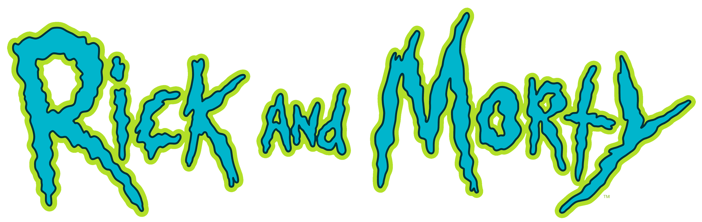
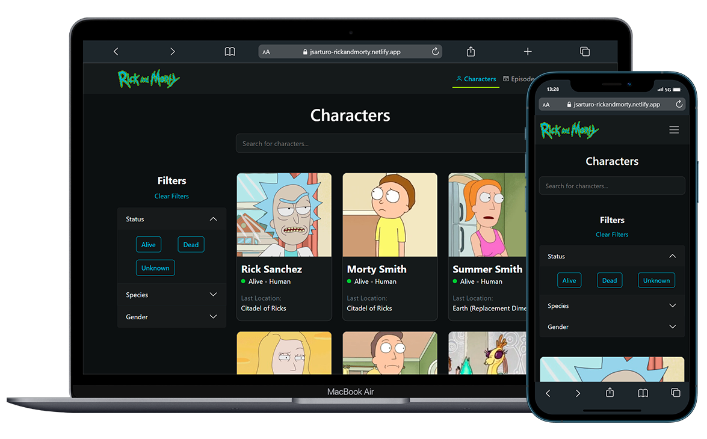

# Wiki - Rick and Morty

Wiki de personajes de Rick and Morty, incluye: paginación, barra de búsqueda, filtrado de datos y enrutamiento dinámico. Tecnologías y librerías utilizadas: ReactJs, Bootstrap, Sass | react-icons, react-loading-skeleton, react-lazy-load-image-component, react-paginate y react-router-dom.


## Screenshots




## Demo en vivo

URL del sitio en vivo: [Wiki - Rick and Morty](https://jsarturo-rickandmorty.netlify.app/)


## Ejecutar localmente

Clonar el proyecto

```bash
  git clone https://github.com/JessArthuro/wiki-rickandmorty.git
```

Ir al directorio del proyecto

```bash
  cd wiki-rickandmorty
```

Instalar dependencias

```bash
  npm install
```

Inicie el servidor

```bash
  npm start
```

Abra [http://localhost:3000](http://localhost:3000) para verlo en su navegador.


## Ejecución de pruebas

Para ejecutar pruebas, ejecute el siguiente comando

```bash
  npm test
```


## Implementación a producción

Para implementar la aplicación en producción, ejecute el siguiente comando

```bash
  npm run build
```